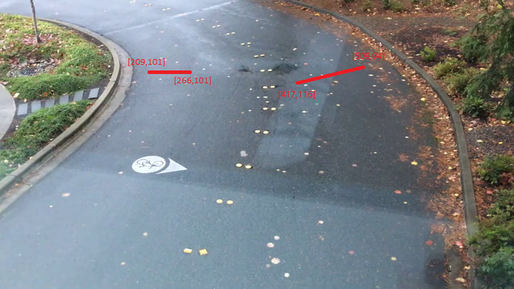

# Configure lines of interest

Rocket enables counting and alerting when objects cross lines of interest in the frame, e.g., cars entering a driveway or people walking into the shop. Rocket takes a line-file as input for its line-based counting/alerting and cascaded DNN calls. 

## Line format and specification 

Each line in the file defines a line-of-interest with the following format. The fields in each line are separated by tabs.

	`<line_count_name> <number_of_lines> <x_1> <y_1> <x_2> <y_2> <overlap_threshold>`

The fields signify the following:
* line_count_name - unique string to name the line.
* number_of_lines - each counting can be done using one line or two lines. This must be set of 1 when only one line is used. (instructions below for number_of_lines = 2)
* x_1, y_1, x_2, y_2 - the X and Y coordinates of the line's endpoints.
* overlap_threshold - this is the fraction of the line that the object is expected to cover for the count/alert to be triggered.  

The file is supplied as a URL during [Rocket deployment](./07_deploy_to_iot_edge_device.ipynb). Here is a [sample line configuration file](https://aka.ms/linesample) manually created for `sample.mkv` inside `\media\`. The two lines are also shown in the picture below, which is a frame from the `sample.mkv` video. (An easy way to mark the lines is to take a "snapshot" from the video, say using VLC, mark the lines on the snapshot frame, and then list the coordinates and parameters of the line in the format specified above to create the line-file.)  
	

When the number_of_lines is 2, this means that two lines are used to count the object in the same direction. That is, the object overlaps the two lines in succession, within a specified time windows. The format for specification becomes more complex as follows. We recommend using number_of_lines to be 2 only if necessary.  

	`<line_count_name> <number_of_lines> <x_1_line1> <y_1_line1> <x_2_line1> <y_2_line1> <overlap_threshold_line1> <x_1_line2> <y_1_line2> <x_2_line2> <y_2_line2> <overlap_threshold_line2> <min_temporal_frames> <max_temporal_frames>`

In the above specification, the X and Y coordinates are specified for both lines along with the overlap_thresholds. In addition, the specification also includes min_temporal_frames and max_temporal_frames that are the minimum and maximum number of frames within which the overlap on the two lines are triggered one after the other. For instance, using min_temporal_frames = 10 and max_temporal_frames = 60 specifies that the object must cross line1 and then cross line2 within the next 10 to 60 frames. These values are set depending on the speed of objects moving in the video.