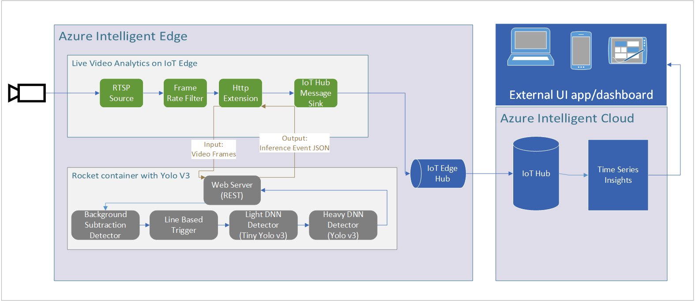

# Live Video Analytics with Project Rocket

[Live video analytics on IoT Edge](https://azure.microsoft.com/en-us/services/media-services/live-video-analytics/) is a new capability of Azure Media Services. LVA provides a platform for you to build intelligent video applications that span the edge and the cloud. The platform offers the capability to capture, record, analyze live video and publish the results (video and/or video analytics) to Azure services (in the cloud and/or the edge). The platform can be used to enhance IoT solutions with video analytics.

:memo:[Project Rocket](https://aka.ms/rocketcode) is  highly extensible software stack to empower everyone to build practical real-world live video analytics applications for object detection & object counting (e.g., cars driving through an intersection), and alerting on objects of interest (e.g., when a customer enters a store). Rocket supports (and has been tested) in many real-world use cases including [directional traffic volumes on live videos from traffic intersections](https://bellevuewa.gov/sites/default/files/media/pdf_document/2020/Video%20Analytics%20Towards%20Vision%20Zero-Traffic%20Video%20Analytics-12262019.pdf), monitoring parking lot occupancies, and counting passengers entering & exiting train stations. 

The :memo:[repository](https://github.com/mustafakasap/rocket/tree/master/rocket_source) features a hybrid edge-cloud video analytics pipeline (built on C# .NET Core), which allows TensorFlow DNN model plug-in, GPU/FPGA acceleration, docker containerization/Kubernetes orchestration, and interactive querying for after-the-fact analysis. Rocket platform’s features are summarized inside :memo:[Rocket-features-and-pipelines.pdf](https://aka.ms/Microsoft-Rocket-LVA-features-and-pipelines.pdf).

We provide a reference architecture with instructions to build and deploy a live video analytics application using [Azure Live Video Analytics](https://azuremarketplace.microsoft.com/en/marketplace/apps/azure-media-services.live-video-analytics-edge?tab=Overview), [Azure IoT Hub](https://azure.microsoft.com/en-us/services/iot-hub/), and memo:[Rocket video analytics platform](https://github.com/microsoft/Microsoft-Rocket-Video-Analytics-Platform). While the instructions enable the deployment of pre-built Rocket containers, we also provide the steps to checkout the code, modify the solution, and build your own custom Rocket container.

## Included vision modules and DNNs

This reference application sample includes: 
1)	Rocket docker containers with OpenCV vision modules as well as the YOLOv3 DNN pre-trained with the [MS-COCO classes](https://gist.github.com/AruniRC/7b3dadd004da04c80198557db5da4bda). It supports GPU execution.
2)	Sample code to use the Rocket docker container with Azure Live Video Analytics on IoT Edge.
3)	Graph topology used to orchestrate the live video analytics pipeline. 
4)	IoT Edge deployment manifest template.

## Architecture Diagram

Below is the general architecture of the video analytics pipeline used in this sample. 

## Supported Cameras

All cameras that use RTSP streaming for their live videos are supported by this reference application. To analyze stored video files, please check out this [sample project](https://github.com/Azure/live-video-analytics/tree/master/utilities/rtspsim-live555) for instructions on simulating a RTSP stream from a video file, packaging your simulator, and deploying it as an edge module into your container registry. You can analyze your video file by pointing this reference application to the simulated RTSP stream of the video file.

## Setting Up Environment

To set up deployment environment, follow instructions from [**01_requirements.md**](../common/01_requirements.md) to [**04_setup_iotedge_device.ipynb**](../common/04_setup_iotedge_device.ipynb) to set up Azure Live Video Analytics.

Once IoT Hub and IoT Edge Device are set up, you can deploy LVA and Rocket containers to the edge device through IoT Hub and connect them through HTTP interface. To use pre-built sample Rocket containers, please skip [**05_build_rocket_image.ipynb**](./notebooks/05_build_rocket_image.ipynb). Section [**05_build_rocket_image.ipynb**](./notebooks/05_build_rocket_image.ipynb) contains the instructions to build your own Rocket container with customized analytics on the videos. 

## Information links

•	Project Rocket webpage – http://aka.ms/rocket  
•	Microsoft Research blog – https://www.microsoft.com/en-us/research/blog/project-rocket-platform-designed-for-easy-customizable-live-video-analytics-is-open-source/  
•	Webinar on Project Rocket – https://note.microsoft.com/MSR-Webinar-Microsoft-Rocket-Registration-Live.html

## Contents

| Folders              | Description                                       |
|----------------------|---------------------------------------------------|
| notebooks			   | Collection of Jupyter notebooks				   |
| csharp 			   | Collection of utilities written in C#			   |									

