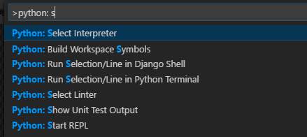

# 1. Requirements for LVA Jupyter Notebook Samples 

## 1.1. Install the Required Tools
To run LVA on Jupyter notebooks, you will first need to install the following tools.  

1. There are many ways to run, manage, and update Jupyter notebooks. Out of the many options, we recommend using Visual Studio Code (VSCode) because it has extensions for running and managing IoT devices as well. Install [Visual Studio Code](https://code.visualstudio.com/) if you do not already have it installed.  

    > <span style="color:red; font-weight:bold"> [!IMPORTANT] </span>  
    > All of the commands in this sample should work as intended on machines running Ubuntu 18.04 and MacOS. If you are using a machine running Windows, you can try either of the following solutions:
    > <br><br>Option 1: Turn on the [Windows Subsystem for Linux](https://code.visualstudio.com/remote-tutorials/wsl/enable-wsl) setting. Afterwards, you will have to log out from your PC and log back in. Then, download [Ubuntu 18.04](https://docs.microsoft.com/en-us/windows/wsl/install-win10#install-your-linux-distribution-of-choice) from the Microsoft store. When installing the tools below, use the Ubuntu terminal. When running the Jupyter notebooks, first  [switch the terminal setting](https://code.visualstudio.com/docs/remote/wsl#_getting-started) in VSCode so that the WSL terminal is used.
    > <br><br>Option 2: Install [Git Bash](https://git-scm.com/downloads). When installing the tools below, use the Git Bash terminal. When running the Jupyter notebooks, first [switch the terminal setting](https://code.visualstudio.com/docs/editor/integrated-terminal) in VSCode so that the Bash terminal is used. 
    > By running either of the two options, you will be effectively using Ubuntu on your development PC. In the proceeding steps, you should install the tools as if you were running an Ubuntu machine.

2. To run the Jupyter notebooks, you will need to have [Python](https://www.python.org/downloads/) version >=3.6 installed.
   
   If you are using an Ubuntu or MacOS machine to run this sample, Python may already be pre-installed. You can check if you already have Python installed by running the commands below:
    ```
    python --version
    ```
    ```
    python3 --version
    ``` 

    You can also check which version of Pip you have by running the commands below:
    ```
    pip --version
    ```
    ```
    pip3 --version
    ``` 
   
     ><span>[!NOTE]</span>
    > Pip is a package management system used to install and manage software packages written in Python. Installing the latest version of Python should also install the latest version of Pip. 

3. If your machine only has one installation of Python 3, running `python` should refer to Python 3. However, if have multiple Python installations, such as Python 2 (which comes pre-installed with many Linux machines) and Python 3, make sure you are using the appropriate version of `python` and `pip`. Use the commands `python` and `pip` for Python 2 or `python3` and `pip3` for Python 3. Based on the version of Python you are running, you may need to update the code cells below with either `pip` or `pip3`. 

   ><span>[!NOTE]</span>
   > This sample was created using Python 3.6.2 and Pip 3, so we use the commands `python3` and `pip3` respectively.

4. Open Visual Studio Code and install the following extensions:  
    - [Python extension](https://marketplace.visualstudio.com/items?itemName=ms-python.python) 
    - [Azure IoT Tools](https://marketplace.visualstudio.com/items?itemName=vsciot-vscode.azure-iot-tools)  
     
## 1.2. Install Jupyter
To get started with Jupyter on VSCode, you first need to have Jupyter installed. 

In VSCode, open a terminal window and run either command based on your version of Pip.

```
pip install jupyter 
```
```
pip3 install jupyter
```

## 1.3. Working with Jupyter Notebooks on VSCode
If you are not familiar with running Jupyter notebooks, we recommend getting started with this tutorial on running [Jupyter on VSCode](https://code.visualstudio.com/docs/python/jupyter-support). When you are running Jupyer on VSCode, be sure to activate the right Python environment for VSCode by using the Command Palette (`Ctrl+Shift+P`) and searching for `Python: Select Interpreter`. Choose the appropriate version of Python that matches your needs.

  

## 1.4. Install Docker
Later in this sample, we will be using Docker to containerize our inference server container image. On your development PC, install the [Docker engine](https://docs.docker.com/engine/install/) based on your operating system. 

> <span style="color:red; font-weight:bold"> [!IMPORTANT] </span>  
> If you are trying to install Docker on a machine running Windows, you should install Docker for Ubuntu, because we will be using Git Bash or the Windows Subsystem for Linux to run LVA.

> <span style="color:red; font-weight:bold"> [!IMPORTANT] </span>  
> If you are using a machine that runs Linux, you may run into Docker issues related to account permissions in later sections of this sample. Instead of the command `sudo docker`, we recommend using the `docker` command without the `sudo` prefix. To run Docker commands on Linux without the `sudo` command, follow the Docker instructions for [managing Docker as a non-root user](https://docs.docker.com/install/linux/linux-postinstall/). Afterwards, you will have to log out from your PC and log back in.

## 1.5. Install the Azure CLI
This sample utilizes Azure. If you do not have an active Azure subscription, you can [create a free Azure account](https://azure.microsoft.com/free/?WT.mc_id=A261C142F). We will mainly be interacting with Azure through Jupyter, but for this to work, you will need to install the [Azure command-line interface](https://docs.microsoft.com/en-us/cli/azure/install-azure-cli?view=azure-cli-latest).

## 1.6. Next Steps
In the following sections of this sample, there will be descriptions and instructions in Markdown cells in each of the Jupyter notebooks. Please carefully read these desctiptions and instructions before running the code cells, in order to ensure successful execution of the sample.

Moreover, we refer to three different environments later in this sample. Here are descriptions for each of them for future reference:
  
1. Azure Cloud Services - cloud-based services run on Azure Datacenters  
2. Development PC - the machine you are currently using to run this sample. This PC should have the required tools mentioned above.  
3. IoT Edge Device - another machine (be it a virtual machine or a computationally light powered mini PC) used to run LVA on the Edge. This IoT Edge device must be installed with a Debian-based Unix system with x64/AMD64 architecture. ARM processors are not supported yet.  

Per your preference, environments 1 and 2 can be the same machine, i.e., developing, debugging, and deploying this sample all on the same IoT Edge device.

After having all the requirements from this section satisfied on your development PC, return to the previous Readme page.