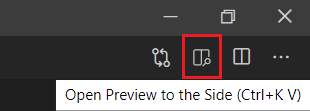
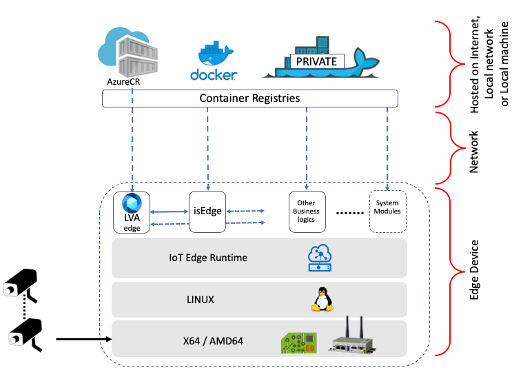

# LVA YoloV3 nGPU ONNX Sample on Jupyter Notebooks 
The following instructions will enable you to run a [YoloV3](http://pjreddie.com/darknet/yolo/) [ONNX](http://onnx.ai/) model on Live Video Analytics (LVA) using Jupyter notebooks. This sample is specific for Nvidia GPU accelerated IoT Edge devices. 

## Prerequisites
1. Install the [requirements for running LVA on Jupyter](../01_requirements.md) on your development PC.
2. After installing all of the required tools, clone the [LVA repository](/../../) locally into your development PC and open the repository with VSCode. 
3. Locate this Readme page in your local repository and continue reading the following sections on VSCode. You can preview Markdown (`.md`) pages by pressing `Ctrl+Shift+V` to open a full-screen window or by clicking the preview button on the top toolbar in VSCode.  
   
    
   
## Getting Started
1. On VSCode, [set up the environment](../02_setup_environment.ipynb) so that we can test and deploy LVA.
   >[!NOTE]
   >Jupyter notebooks (`.ipynb`) may take several seconds to render in VSCode.
2. Create the required [Azure services](../03_create_azure_services.ipynb).
3. Create an [Azure virtual machine](../04_create_vm_iotedge_device.ipynb) if you
   * do not have a physical IoT Edge device, or 
   * want to use a VM to test this sample.
    > [!NOTE]
    > If you want to run the following sections, you must create a GPU accelerated VM such as the Standard_NC6 VM, which has an NVidia GPU.

<!--
    Change the following steps based on specific instructions.
-->

## Install Drivers for IoT Edge Device
1. Once you have created your VM, check to see what [type of GPU](https://docs.microsoft.com/en-us/azure/virtual-machines/sizes-gpu?toc=/azure/virtual-machines/linux/toc.json&bc=/azure/virtual-machines/linux/breadcrumb/toc.json) comes with your VM. 
2. If your VM has an NVidia GPU, [install](../06_install_iotedge_runtime_gpu.md) IoT Edge runtime and the required drivers and tools for your NVidia GPU. 

## Build a Docker Image of the Inference Server
The following sections will explain how to build a Docker image of an inference server that uses AI logic (i.e., YoloV3 for object detection) on a GPU accelerated VM.
1. Create a [YoloV3 inference engine](yg1_create_inference_engine.ipynb). The inference engine wrapper will retrieve image data, analyze it, and return the analysis as output.
2. Create a [local Docker image](yg2_create_local_container_image.ipynb) to containerize the ML solution. The ML solution consists of a web application and an inference server.
3. You may want to [test the Docker image locally](yg3_local_test.ipynb) before uploading the Docker image to a container registry, to ensure that it runs as expected.

## Deploy Your Docker Image
The image below summarizes the deployment scheme of LVA. As the image indicates, LVA can utilize containers hosted on the Internet, on a local network, or even on a local machine.

  

The following sections will explain how to deploy your Docker image and run media graphs on LVA. 

1. After you have tested your Docker image, upload the [container image](../07_upload_container_image_to_acr.ipynb) to Azure Container Registry (ACR).
2. Once the image has been uploaded onto ACR, you can now [deploy the inference server](../08_deploy_iotedge_modules.ipynb) to an IoT Edge device using a module deployment manifest. 
3. Finally, deploy [media graphs](../09_deploy_media_graph.ipynb) to trigger the inference server and test to see if it works as desired.
