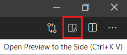
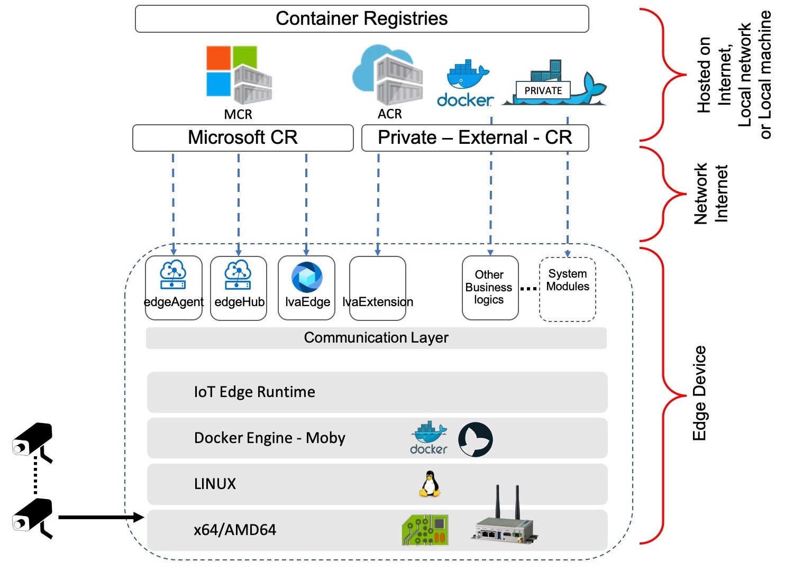

# LVA YoloV3 iCPU ONNX Sample on Jupyter Notebooks 
The following instructions will enable you to run a [YoloV3](http://pjreddie.com/darknet/yolo/) [ONNX](http://onnx.ai/) model on Live Video Analytics (LVA) using Jupyter notebooks. This sample is specific for Intel® CPU accelerated IoT Edge devices. 

## Prerequisites
Out of the many options to run, manage, and update Jupyter notebooks, we recommend using Visual Studio Code (VSCode) because it has extensions for running and managing IoT devices as well. Install [Visual Studio Code](https://code.visualstudio.com/docs/setup/setup-overview) if you do not already have it installed. 

1. [Clone](https://code.visualstudio.com/Docs/editor/versioncontrol#_cloning-a-repository) this [repository](/../../) locally into your development PC and open the repository with VSCode. 
2. Locate this Readme page in your local repository and continue reading the following sections on VSCode. You can preview Markdown (`.md`) pages by pressing `Ctrl+Shift+V` to open a full-screen window or by clicking the preview button on the top toolbar in VSCode. For pictures to render on VSCode, you must have the entire [live-video-analytics](/../..) folder open in your VSCode workspace. Going forward, we will be using VSCode to run this sample. Please navigate to VSCode to continue. 
   
    
    

3. Install the [requirements for running LVA Jupyter notebook samples](../../../common/requirements.md) on your development PC.

## Getting Started
1. In VSCode, [set up the environment](../../../common/setup_environment.ipynb) so that we can test and deploy LVA.
   >[!NOTE]
   >Jupyter notebooks (`.ipynb`) may take several seconds to render in VSCode.
2. Create the required [Azure services](../../../common/create_azure_services.ipynb).
3. You will need an IoT Edge device to deploy the LVA and this sample generated containers. If you don't have a physical IoT Edge device, you can create an [Azure virtual machine](../../../common/create_azure_vm.ipynb).

    >  [!IMPORTANT]   
    > If you want to run the following sections, you must create a CPU accelerated VM such as the Standard_DS3_v2 VM, which has an Intel® CPU.

<!--
    Change the following steps based on specific instructions.
-->

## Install IoT Edge Runtime for IoT Edge Device
1. [Install](../../../common/install_iotedge_runtime_cpu.md) IoT Edge runtime and the required tools on your Edge device. 

## Build a Docker Container Image of the Inference Server Solution
The following sections will explain how to build a Docker container image of an inference server solution that uses AI logic (i.e., YoloV3 for object detection) on a CPU accelerated IoT Edge Device.
1. Create a [YoloV3 inference engine](create_yolov3_icpu_inference_engine.ipynb). The inference engine wrapper will retrieve image data, analyze it, and return the analysis as output.
2. Create a [local Docker image](create_yolov3_icpu_container_image.ipynb) to containerize the ML solution. The ML solution consists of a web application and an inference server.
3. To push the Docker image to the cloud, [Upload the container image](../../../common/upload_container_image_to_acr.ipynb) to Azure Container Registry (ACR).

## Deploy Your Docker Container Image and LVA Modules
The image below summarizes the deployment scheme of LVA. As the image indicates, LVA can utilize containers hosted on the Internet, on a local network, or even on a local machine.

  

The following section will explain how to deploy your Docker image and run media graphs on LVA. 

1. [Deploy the inference server](../../../common/deploy_iotedge_modules.ipynb) to an IoT Edge device using a deployment manifest. For this sample, we will be using the pre-built deployment manifest template named [deployment.lva_common.template.json](../../../common/deployment.lva_common.template.json).

## Deploy Media Graphs and Test LVA
1. To run inferences, [deploy media graphs](../../../common/deploy_media_graph.ipynb) to trigger the inference server.
2. Once the media graphs are deployed, [monitor the output](../../../common/monitor_output.md) of the inference server and test to see if it works as desired.
3. Finally, [deactivate and delete](../../../common/delete_media_graph.ipynb) the media graphs to stop the inferences.

| Notebook name                                                                                | Description                                                                                              |
| -------------------------------------------------------------------------------------------- | ---------------------------------------------------------------------------------------------------------|
| [setup_environment.ipynb](../../../common/setup_environment.ipynb)                           | Notebook that will help set up the environment so that we can test and deploy LVA                        |
| [create_azure_services.ipynb](../../../common/create_azure_services.ipynb)                   | Notebook that will create the required Azure resources                                                   |
| [create_azure_vm.ipynb](../../../common/create_azure_vm.ipynb)                               | Notebook that help you to chose and configure a Virtual Machine that will act as the IoT Edge device     |
| [create_yolov3_icpu_inference_engine.ipynb](create_yolov3_icpu_inference_engine.ipynb)       | Notebook that will help create a nCPU accelerated YoloV3 Inference Engine                                |
| [create_yolov3_icpu_container_image.ipynb](create_yolov3_icpu_container_image.ipynb)         | Notebook that will help create a local Docker container image.   This image acts as an Inference Server and is an HTTP web server with a scoring REST endpoint |
| [upload_container_image_to_acr.ipynb](../../../common/upload_container_image_to_acr.ipynb)   | This notebook shares the steps to upload your local container to your Azure Container Registry (ACR)     |
| [create_yolov3_icpu_deployment_manifest.ipynb](create_yolov3_icpu_deployment_manifest.ipynb) | This notebook will help in creating a deployment manifest file which is used to deploy your Docker image |
| [deploy_iotedge_modules.ipynb](../../../common/deploy_iotedge_modules.ipynb)                 | This notebook will help deploy LVA & Inference Server modules to an IoT Edge device                      |