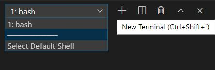
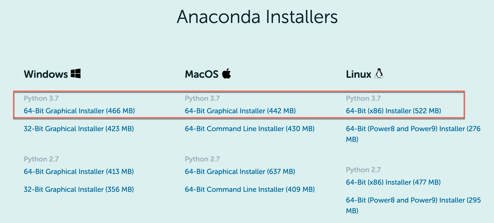
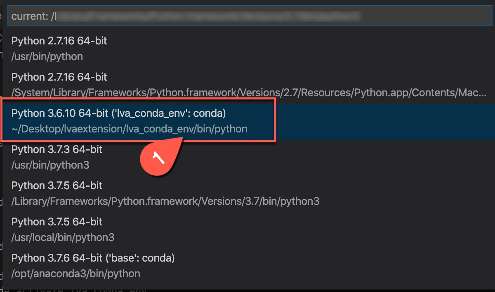

# Requirements for LVA Jupyter Notebook Samples 

## Install the Required Tools
To run LVA on Jupyter notebooks, you will first need to install the following tools on your development PC.  

1. Out of the many options to run, manage, and update Jupyter notebooks, we recommend using Visual Studio Code (VSCode) because it has extensions for running and managing IoT devices as well. Install [Visual Studio Code](https://code.visualstudio.com/docs/setup/setup-overview) if you do not already have it installed. 
    
    <u>Windows Installation</u>

    All of the commands in this sample should work as intended on development PCs running Ubuntu 18.04 and MacOS. If you are using a machine running Windows, you can try either of the following solutions:
    <br><br>Option 1: Turn on the [Windows Subsystem for Linux](https://code.visualstudio.com/remote-tutorials/wsl/enable-wsl) setting. Afterwards, you will have to log out from your PC and log back in. Then, [upgrade to WSL 2](https://docs.microsoft.com/en-us/windows/wsl/install-win10) and download [Ubuntu 18.04 terminal](https://www.microsoft.com/en-us/p/ubuntu-1804-lts/9n9tngvndl3q?rtc=1&activetab=pivot:overviewtab) from the Microsoft store. When installing the tools below, use the Ubuntu terminal and install the Ubuntu versions of the applications. When running the Jupyter notebooks, first install the [Remote - WSL extension](https://marketplace.visualstudio.com/items?itemName=ms-vscode-remote.remote-wsl) and then [switch the terminal setting](https://code.visualstudio.com/docs/remote/wsl#_open-a-remote-folder-or-workspace) in VSCode so that the WSL terminal is used.
  
    Option 2: Install [Git Bash](https://git-scm.com/downloads). When installing the tools below, use the Git Bash terminal. When running the Jupyter notebooks, [open VSCode](https://code.visualstudio.com/docs/editor/command-line#_launching-from-command-line) using the Git Bash terminal and [switch the terminal setting](https://code.visualstudio.com/docs/editor/integrated-terminal) so that the Bash terminal is used. You will now be able to run Bash commands on Jupyter notebooks using VSCode. Make sure that in the VSCode terminal window, you click the dropdown and select **bash**.    
    
    

2. In Visual Studio Code, install the following extensions:  
    - [Python extension](https://marketplace.visualstudio.com/items?itemName=ms-python.python) 
    - [Azure IoT Tools](https://marketplace.visualstudio.com/items?itemName=vsciot-vscode.azure-iot-tools)     

3. To run the Jupyter notebooks, you will need to have [Anaconda](https://www.anaconda.com/products/individual) installed with Python 3.7. When installing Anaconda, please choose to add Anaconda to your Path. If you wish to install Anaconda for all users, [read the Anaconda documentation](https://docs.anaconda.com/anaconda/install/multi-user/) for instructions on how to do so.   
    <br>
   
## Setting Up the Conda Environment
Once Anaconda is installed, we will be creating a Conda environment to hold all our dependencies for this sample. Notice that in this folder, we have a file named [environment.yml](environment.yml), which lists all of our dependencies. We will be using this file to set up the Conda environment and install all the necessary packages, including Jupyter. In your terminal, navigate to this folder and run the following command:

```
conda env create --prefix ./lva_conda_env --file environment.yml
```

In VSCode, [set the Python environment](https://code.visualstudio.com/docs/python/environments) so that the Conda installation of Python is in use.



For additional information, you can read more about [managing Conda environments](https://docs.conda.io/projects/conda/en/latest/user-guide/tasks/manage-environments.html)

## Install Docker
Later in this sample, we will be using Docker to containerize our inference server solution, named "lvaExtension", to create a container image. On your development PC, install Docker based on your development PC's operating system:
* [MacOS](https://docs.docker.com/docker-for-mac/install/)
* [Linux](https://docs.docker.com/engine/install/)
* [Windows on WSL 2](https://docs.docker.com/docker-for-windows/wsl/)
* [Windows on Git Bash](https://docs.docker.com/docker-for-windows/install/)

> <span style="color:grey; font-weight:bold"> [!TIP] </span>  
> If you are using a Unix-based development PC (e.g., running Ubuntu, MacOS, or Windows with WSL), you may run into Docker issues related to account permissions in later sections of this sample. Instead of the command `sudo docker`, we recommend using the `docker` command without the `sudo` prefix. To run Docker commands on Linux without the `sudo` command, follow the Docker instructions for [managing Docker as a non-root user](https://docs.docker.com/install/linux/linux-postinstall/). Afterwards, you will have to log out from your development PC and log back in.

## Create Azure Account
Because this sample utilizes Azure, you will need an active Azure subscription to run the following sections. If you do not have an active Azure subscription, you can [create a free Azure account](https://azure.microsoft.com/free/?WT.mc_id=A261C142F). 

## Install the Azure CLI
To create Azure services, install the Azure Command Line Interface (version >= 2.7.0) based on your development PC's operating system:
* [MacOS](https://docs.microsoft.com/en-us/cli/azure/install-azure-cli-macos?view=azure-cli-latest)
* [Linux](https://docs.microsoft.com/en-us/cli/azure/install-azure-cli-apt?view=azure-cli-latest)
* [Windows on WSL 2](https://docs.microsoft.com/en-us/cli/azure/install-azure-cli-apt?view=azure-cli-latest)
* [Windows on Git Bash](https://docs.microsoft.com/en-us/cli/azure/install-azure-cli-windows?view=azure-cli-latest&tabs=azure-cli)

Remember to use the correct terminal for installing the Azure CLI. Even if you already have the Azure CLI installed, you may want to re-install it.

<!-- NO LONG NEEDED?
## Install Jupyter
To get started with Jupyter on VSCode, you first need to have Jupyter installed on your development PC. 

In VSCode, open the terminal window and run the following command:
```
pip3 install jupyter
```
> [!NOTE]    
> We used `pip3` in the command above because we are running Python 3. In your case, use `pip` or `pip3` depending on your installed version of Python.
-->

## Working with Jupyter Notebooks on VSCode
If you are not familiar with running Jupyter notebooks, we recommend getting started with this tutorial on running [Jupyter on VSCode](https://code.visualstudio.com/docs/python/jupyter-support).

## Next Steps
In the following sections of this sample, there will be descriptions and instructions in Markdown cells in each of the Jupyter notebooks. Please carefully read these descriptions and instructions before running the code cells, in order to ensure successful execution of the sample. After having all the requirements from this section satisfied on your development PC, return to the previous Readme page.
