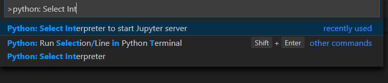

# Requirements for LVA Jupyter Notebook Samples 
In this section, we will install the required tools to run LVA on Jupyter notebooks.

## Install the Required Tools
1. In Visual Studio Code, install the following extensions:  
    * [Python extension](https://marketplace.visualstudio.com/items?itemName=ms-python.python) 
    * [Azure IoT Tools](https://marketplace.visualstudio.com/items?itemName=vsciot-vscode.azure-iot-tools)     

2. To run the Jupyter notebooks, you will need to have [Anaconda](https://www.anaconda.com/products/individual) installed with Python 3.7. When installing Anaconda, select the option that adds Anaconda to your Path, by clicking the checkbox on a graphical installation or by typing 'yes' where appropriate. If you wish to install Anaconda for all users, [read the Anaconda documentation](https://docs.anaconda.com/anaconda/install/multi-user/) for instructions on how to do so.   
    <br>
   
## Setting Up the Conda Environment
Once Anaconda is installed, we will be creating a Conda environment to hold all our dependencies for this sample. Notice that in this folder, we have a file named [environment.yml](environment.yml), which lists all of our dependencies. We will be using this file to set up the Conda environment and install all the necessary packages, including Jupyter. In your terminal, navigate to this folder and run the following command:

```
conda env create --prefix ./lva_conda_env --file environment.yml
```

After running the Conda script above, restart your development PC. Once your development PC has restarted, open VSCode again. 
* If, once you open your terminal on VSCode, you get a message that says "To activate this environment...", you can ignore the message.
* If you get the following message in VSCode, follow the instructions to turn off the `inheritEnv` setting.
    
    

Next, [set the Python environment](https://code.visualstudio.com/docs/python/environments) in VSCode by using the Command Palette (`Ctrl+Shift+P`) and searching for "Python: Select Interpreter" so that the Conda installation of Python is in use.


Similarly, set the Python environment to start the Jupyter server by using the Command Palette (`Ctrl+Shift+P`) and searching for "Python: Select Interpreter to start Jupyter server". If you are running into issues related to Python package dependencies, you may be using the wrong Python interpreter. The correct Python interpreter should have `lva_conda_env` in its directory.



For additional information, you can read more about [managing Conda environments](https://docs.conda.io/projects/conda/en/latest/user-guide/tasks/manage-environments.html)

## Install Docker
Later in this sample, we will be using Docker to containerize our inference server solution, named "lvaExtension", to create a container image. On your development PC, install Docker based on your development PC's operating system:
* [Linux](https://docs.docker.com/engine/install/)
* [Windows](https://docs.docker.com/docker-for-windows/install/)
* [MacOS](https://docs.docker.com/docker-for-mac/install/)

> <span style="color:grey; font-weight:bold"> [!TIP] </span>  
> If you are using a Unix-based development PC (e.g., running Ubuntu, MacOS, or Windows with WSL), you may run into Docker issues related to account permissions in later sections of this sample. Instead of the command `sudo docker`, we recommend using the `docker` command without the `sudo` prefix. To run Docker commands on Linux without the `sudo` command, follow the Docker instructions for [managing Docker as a non-root user](https://docs.docker.com/install/linux/linux-postinstall/). Afterwards, you will have to log out from your development PC and log back in.

## Create Azure Account
Because this sample utilizes Azure, you will need an active Azure subscription to run the following sections. If you do not have an active Azure subscription, you can [create a free Azure account](https://azure.microsoft.com/free/?WT.mc_id=A261C142F). 

## Install the Azure CLI
To create Azure services, install the Azure Command Line Interface (version >= 2.7.0) based on your development PC's operating system:
* [Linux](https://docs.microsoft.com/en-us/cli/azure/install-azure-cli-apt?view=azure-cli-latest)
* [Windows](https://docs.microsoft.com/en-us/cli/azure/install-azure-cli-windows?view=azure-cli-latest&tabs=azure-cli)
* [MacOS](https://docs.microsoft.com/en-us/cli/azure/install-azure-cli-macos?view=azure-cli-latest)

Remember to use the correct terminal for installing the Azure CLI. Even if you already have the Azure CLI installed, you may want to re-install it.

## Working with Jupyter Notebooks on VSCode
If you are not familiar with running Jupyter notebooks, we recommend getting started with this tutorial on running [Jupyter on VSCode](https://code.visualstudio.com/docs/python/jupyter-support).

## Next Steps
In the following sections of this sample, there will be descriptions and instructions in Markdown cells in each of the Jupyter notebooks. Please carefully read these descriptions and instructions before running the code cells, in order to ensure successful execution of the sample. After having all the requirements from this section satisfied on your development PC, return to the previous Readme page.
